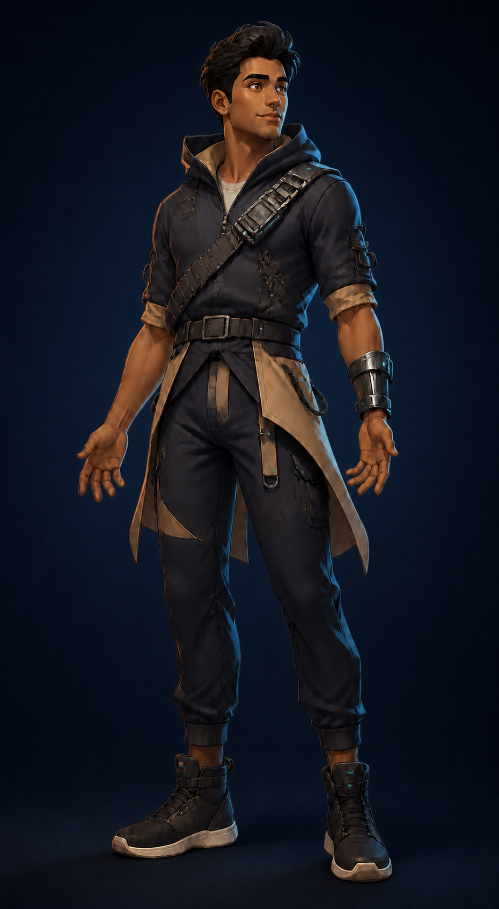
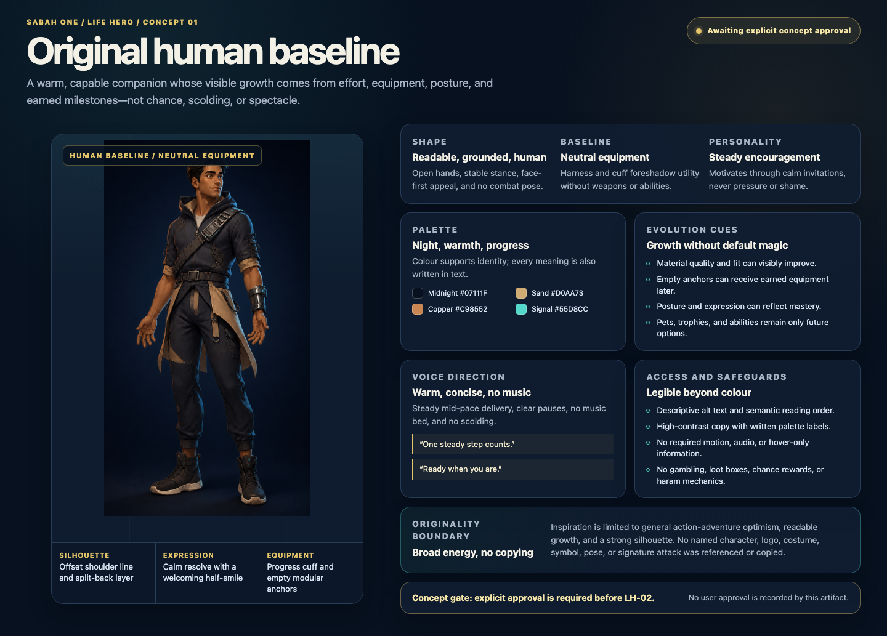
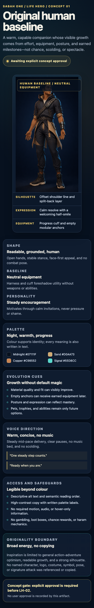

# Life Hero Original Concept

Status: approval concept for KAN-257. This is an isolated visual and behavioural prototype, not production progression or evidence of user approval.



## Authority and boundary

The deterministic HTML artifact at `public/concepts/life-hero/index.html` is the approval surface. The generated raster provides the character portrait only; all copy, safeguards, responsive behaviour, and accessibility semantics come from reviewed HTML and CSS.

This ticket adds no provider, game loop, progression model, dashboard integration, mutation path, reward mechanic, pet, ability, or approval state. LH-02 remains blocked on explicit concept approval managed outside this artifact.

## Concept

- **Silhouette:** offset shoulder line, split-back utility layer, stable athletic stance, open hands, and no combat pose.
- **Face:** warm brown skin, dark textured swept-up hair, clear eyes, and a calm determined half-smile.
- **Palette:** midnight indigo and charcoal, warm sand, restrained copper, and small turquoise equipment signals. Meaning is never colour-only.
- **Equipment baseline:** a non-weapon progress cuff, modular cross-body harness, and empty attachment anchors.
- **Evolution cues:** later visual growth may use improved materials, fit, posture, expression, and earned equipment. Pets, trophies, abilities, and achievements remain only future options.
- **Personality:** calm invitations and concise encouragement; never pressure, shame, or scolding.
- **Voice:** warm mid-paced delivery with clear pauses, no music bed, and no required audio.

## Originality and safety

Inspiration is limited to broad action-adventure optimism, readable progression, and a strong silhouette. No named character, franchise, logo, costume, symbol, pose, or signature attack was used as a reference or copied.

The concept includes no weapon, magic, aura, gambling, chance reward, loot box, haram mechanic, music equipment, or religious symbol.

## Accessibility and responsive contract

- The character has descriptive alt text and the page has semantic heading and reading order.
- Written labels accompany palette and state information.
- The artifact has no required animation, audio, hover-only content, or fixed-height text clipping.
- Desktop target: 1440 by 900 with portrait and specification visible as two columns.
- Mobile target: 390 by 844 with heading and full hero portrait first, followed by one-column specification cards and no horizontal overflow.
- Forced-colours mode removes decorative backgrounds and preserves visible borders.

## Rendered evidence

### Desktop — 1440 by 900 viewport



### Mobile — 390 by 844 viewport



| State | Rendered observation |
| --- | --- |
| Desktop 1440 by 900 | Hero image loaded at its natural 930 by 1691 size and rendered at 498 by 610 CSS px. Document client/scroll width was 1425/1425 with no horizontal overflow. |
| Mobile 390 by 844 | Heading precedes the hero; the hero rendered at 269 by 474 CSS px inside the first viewport. Document client/scroll width was 375/375 with no horizontal overflow. |
| Mobile scroll | The document is the owning scroller. A 620 CSS px wheel movement changed `scrollY` from 0 to 620 and moved the offscreen approval gate by the same amount. |
| Motion | The artifact defines no animation or motion-dependent meaning. |

The full-page desktop PNG is 1440 by 1033 with SHA-256 `12d5e2154f41fb1eb083c66503ffa144d4d9b0be11aef1611c7d76e9e97f27d3`. The full-page mobile PNG is 390 by 2498 with SHA-256 `26bd88855c92b4d4775efb37f6f28156bd21ce806db253717253c107c1c9b3ca`.

## Generation record

| Item | Evidence |
| --- | --- |
| Mode | Built-in image generation, `stylized-concept`, followed by built-in background edits |
| Generated size | 930 by 1691 PNG |
| Selected asset | `public/concepts/life-hero/life-hero-concept.png` |
| SHA-256 | `c14763d2cd25a37eb4d433a26ad9ea25d5aeffeaaacc4fa82368fcce9e690b59` |
| Alpha decision | Two transparency attempts returned `hasAlpha: no`; the selected output intentionally uses an opaque midnight-navy background |

### Selected prompt set

Initial generation:

```text
Use case: stylized-concept
Asset type: original game character concept cutout for a responsive web approval artifact
Primary request: Create one wholly original anime-inspired adult human Life Hero, using only broad energy, optimism, and visible growth-readiness associated with action-adventure illustration. The person must not resemble any existing named character or franchise.
Scene/backdrop: genuinely transparent background, no environment, no frame
Subject: one generic human hero with warm brown skin, dark textured swept-up hair, clear expressive eyes, and a calm determined half-smile; full body visible in a relaxed three-quarter neutral stance; open empty hands; approachable, motivational, never aggressive or scolding
Silhouette and progression cues: strong readable silhouette built from an offset shoulder line, a short split-back utility layer, stable athletic stance, and a compact non-weapon cross-body equipment harness; a slim forearm progress cuff and several empty modular attachment loops subtly imply future equipment and growth without depicting abilities
Style/medium: polished original 2.5D character concept illustration, clean painterly cel shading, refined but practical product concept art
Composition/framing: tall portrait cutout, centered, full body with generous transparent padding around hair, hands, and feet; face remains legible when displayed at mobile width
Lighting/mood: soft warm key light with restrained cool rim light; grounded, hopeful, capable
Color palette: midnight indigo and charcoal base, warm sand panels, restrained copper accents, tiny turquoise status lights
Materials/textures: matte technical fabric, soft woven straps, brushed metal cuff; no armor plating
Text: none
Constraints: original IP-safe design only; adult human; no weapon; no fighting stance; no copied costume, hair silhouette, logo, emblem, symbol, pose, named-character feature, or signature attack; no magic, aura, energy blast, supernatural effect, wings, pet, trophy, gambling, cards, dice, loot box, religious symbol, music equipment, headphones, watermark, or background; transparent alpha must be preserved
```

Selected background correction:

```text
Use case: precise-object-edit
Asset type: opaque web character portrait for a responsive approval artifact
Primary request: Replace only the checkerboard background with a clean, seamless deep midnight-navy studio backdrop (#07111F) using a very subtle centered radial lift and a restrained soft floor shadow under the boots.
Input images: Image 1 is the edit target and must remain the same character.
Constraints: preserve the character exactly—same face, hair, body proportions, expression, pose, open hands, outfit, harness, forearm cuff, colors, textures, lighting, crop, and edge detail; no redesign or restyling; no text, logo, emblem, symbol, star, aura, magic, energy effect, object, frame, watermark, or checkerboard; keep the background quiet and product-like.
```
