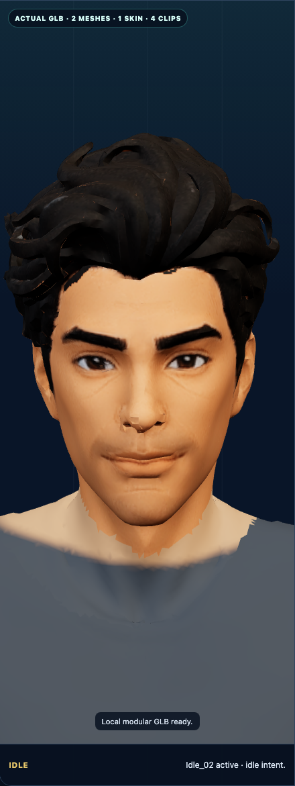
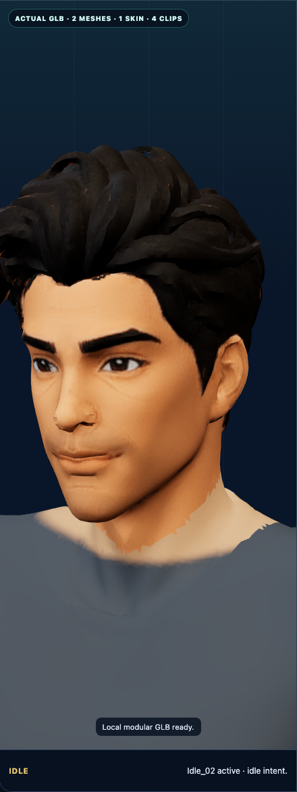
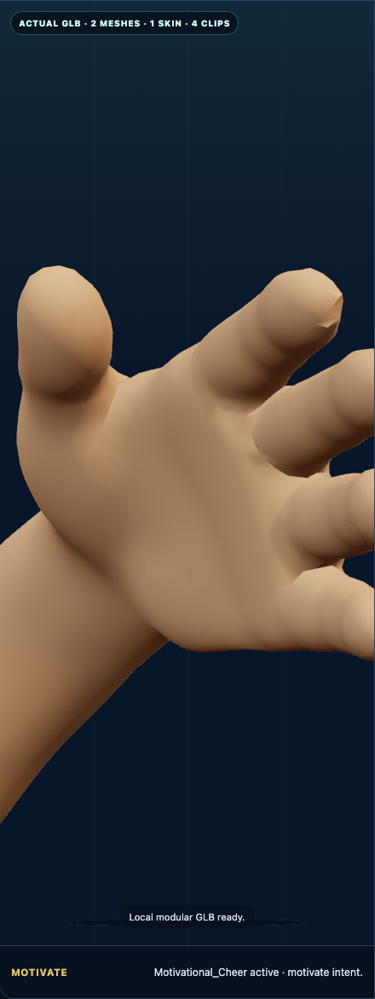
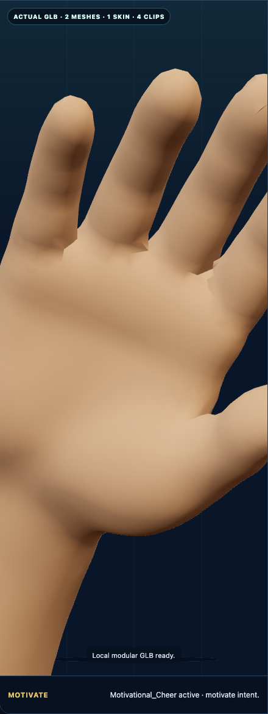
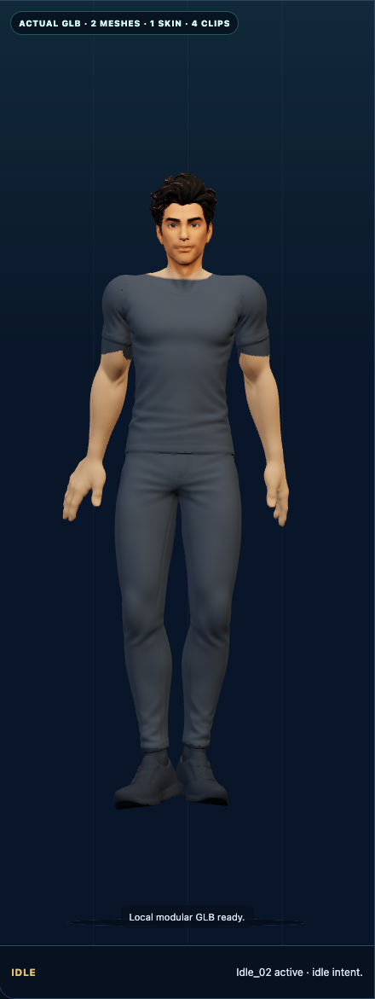
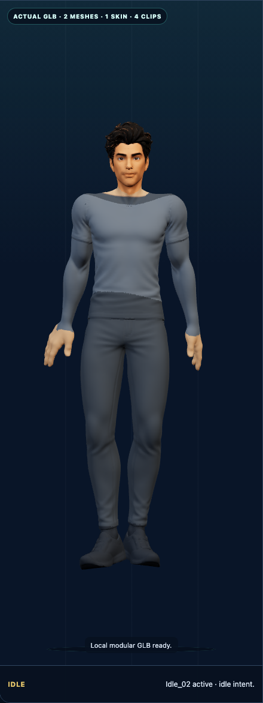
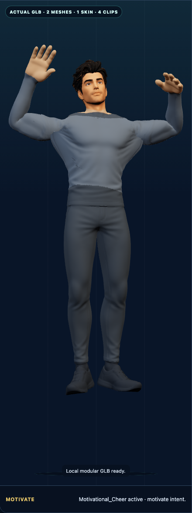

# Life Hero Animated Modular Concept

Status: KAN-257 milestone candidate awaiting Sol and user approval. This is an isolated animated-GLB and modular-clothing proof, not a production avatar system, dashboard feature, persistence layer, progression system, or minigame.

## Honest artifact boundary

The approval surface is `concepts/life-hero/index.html`. It loads the project-bound `public/concepts/life-hero/assets/life-hero-modular.glb` through a small Three.js viewer.

This milestone does prove:

- an actual binary glTF 2.0 model renders in the browser;
- a complete neutral body and one jacket are distinct mesh nodes;
- both mesh nodes bind to the same 24-joint skin;
- the jacket can be hidden or shown without regenerating or replacing the body;
- `Idle_02`, `Motivational_Cheer`, `Running`, and `Walking` remain embedded;
- the same animation mixer drives the body and jacket;
- explicit static and `prefers-reduced-motion` fallbacks remain usable.

It does not prove a production rig, final topology, final garment quality, generalized wardrobe compatibility, body masking, production frame rate, dashboard placement, persistence, progression, analytics, voice, or minigame behavior.

`public/concepts/life-hero/life-hero-concept.png` remains approved art direction and a static visual fallback only. It is one flattened raster image, not a 3D model. It contains no skeleton, meshes, source layers, equipment slots, animation clips, visibility masks, or compatibility metadata.

## Model milestone

The previous trial contained 3,787 vertices and 4,193 triangles, and the rejected cross-character candidate reduced the paid source to 31,045 triangles before transferring an unrelated rig. This correction keeps the highest-quality zero-credit native remesh Meshy's humanoid rig accepted: 105,568 vertices and 174,754 triangles. The face, hair silhouette, proportions, and five-finger hands are materially clearer than the trial and rejected candidate. This is a review candidate, not a claim of final production fidelity or user acceptance.

The final exported structure was inspected from the GLB JSON and binary buffers locally; Meshy viewer “parts” were not used as acceptance evidence.

| Node | Mesh | Skin | Geometry | Role |
| --- | ---: | ---: | --- | --- |
| `LifeHero_BaseBody` | 0 | 0 | 105,568 vertices; 174,754 triangles | Complete original character with neutral underlayer and native same-body skin. |
| `LifeHero_Jacket` | 1 | 0 | 31,604 vertices; 56,420 triangles | Separate fitted graphite jacket; runtime-toggleable skinned clothing proof. |

Skin 0 contains 24 joints. Every body material primitive and the jacket primitive contain `JOINTS_0` and `WEIGHTS_0`. Hiding `LifeHero_Jacket` leaves `LifeHero_BaseBody` intact.

### Deterministic material correction

The paid native atlas contains large black gaps between UV islands. The rejected render reused that atlas as both base colour and fully white emissive output across the whole body and jacket, so filtering exposed black/torn seams at wrists, palms, neckline, sleeves, trousers, and garment edges while flattening lighting.

This zero-credit correction does not inpaint, regenerate, remesh, or reskin the character. `native-joints-position-v1` classifies the existing native triangles by centroid position and native joint influence, then emits four index-only body primitives that all reuse the exact original position, UV, joint, and weight accessors. The untouched source normal accessor remains in the GLB as an inspection reference; the rendered primitives use the deterministic review-normal accessor described below.

| Region | Triangles | Material treatment |
| --- | ---: | --- |
| `identity-texture` | 15,637 | Paid native texture retained for head, face, and hair; emissive removed. |
| `clean-skin` | 29,191 | Texture-free rough skin PBR for neck, arms, wrists, palms, and fingers. |
| `clean-underlayer` | 111,092 | Texture-free rough charcoal PBR for the complete neutral clothing layer. |
| `clean-shoes` | 18,834 | Texture-free rough graphite PBR. |

The four regions total the unchanged 174,754 native body triangles. The jacket uses one texture-free rough graphite PBR material and no inherited vertex-colour trim. This deliberately trades atlas detail outside the face and hair for deterministic seam-free review surfaces; it is a bounded concept-material pass, not final texture authoring.

### Render-normal, neckline, and studio-light polish

`angle-weighted-welded-v1` recomputes only the rendered `NORMAL` values. It welds position-identical seam vertices at `0.00001` tolerance, accumulates corner-angle-weighted face normals, and refuses to join source-normal clusters separated by 45 degrees or more. Hair, shoes, and garment creases therefore retain deliberate hard boundaries. Across 16,907 independently measured weldable seam pairs, mean discontinuity falls from 18.6906 degrees to 0.6680 degrees and p95 falls from 41.2790 degrees to effectively zero. The 4,272 retained hard-edge pairs still average 79.5761 degrees. Source normal SHA-256 is `85899d4db6c3efac050b3e8461e51f238f602ecc1a4df0e6200b269809a45569`; rendered normal SHA-256 is `7a85474bfb9dbf70dd45c1db262e11a6ded8e0d0953321d3a6e799132cd367d6`.

The bounded `bounded-same-body-collar-fade-v3` treatment colours only existing skin vertices in the native neck box. It fades 273 vertices between model-space Y 1.413 and 1.421, with 1,788 affected collar vertices in total. No duplicate surface, offset shell, texture inpainting, or geometry edit is introduced, so there is no new Z-fighting path. `neutral-fill-v3` keeps ACES tone mapping and rough non-emissive PBR while using a brighter neutral lower hemisphere so the face and both raised palms remain readable.

The immutable source values remain exact:

| Native value | SHA-256 |
| --- | --- |
| `POSITION` | `2224d1324c78cd3f8915965f8993bbe60cf31fa8e814f3524a048541f2cc3888` |
| `JOINTS_0` | `107967db947424c88c19f55a8a30b08bfcf463200f2f2593ff1728d2711211f8` |
| `WEIGHTS_0` | `8c69c1e6ddd2a7e357caf16d81f9aa7a91e1dadf44276be2ce9302362cd427f2` |
| inverse bind matrices | `72fda20685a70671a78782d99499c9ab3b30841c44614345c71de080a5bdb849` |

### Jacket proof and limitation

The jacket is a genuinely separate mesh generated locally from the exact native-rigged body's upper-torso and arm surface. Every jacket vertex records its native body source vertex in `_SOURCE_VERTEX`; its `JOINTS_0` and `WEIGHTS_0` values are copied byte-for-byte from that source vertex. No old-character skeleton, bounds alignment, nearest-neighbour skin transfer, or approximate weight generation remains. The mesh is not a Meshy viewer grouping and is not baked into the body's texture or geometry.

Idle at 0.7 seconds and Motivational Cheer at 4.5 seconds show the jacket following the same-body rig without severe clipping or tearing. The viewer uses polygon offset to present coincident proof surfaces without z-fighting. The restrained uniform graphite surface and its fitted source-triangle boundaries are concept architecture—not authored production clothing. It does not establish garment topology, collision, cloth simulation, generalized sizing, or wardrobe readiness.

## Embedded motion proof

The exported GLB preserves these exact clips in this exact order:

| Embedded clip | Channels / samplers | Concept control |
| --- | ---: | --- |
| `Idle_02` | 72 / 72 | Native Meshy `Idle 4`, renamed at assembly; also slowed for low momentum. |
| `Motivational_Cheer` | 72 / 72 | Motivate. |
| `Running` | 72 / 72 | Train. |
| `Walking` | 72 / 72 | Focus. |

The mapping is explicit because this proof retains exporter clip names. The production contract below uses stable semantic names and must adapt exporter-specific names at ingestion rather than exposing array positions to consumers.

## Fallback and access behavior

- Normal mode renders and animates the real GLB.
- The visible Static fallback control replaces the canvas with the separate SVG body, clothing, and gear stack.
- `prefers-reduced-motion: reduce` forces that static stack and disables the 3D-motion control.
- The SVG harness, cuff, pack, and sash remain independently toggleable architecture assets. They are clearly labelled as concept-only; only the jacket is a real GLB clothing mesh in this milestone.
- The flattened PNG remains separately visible as approved art direction and another static reference.
- Controls are keyboard-operable, visibly focused, and paired with live text status.

## Bounded generation and local assembly pipeline

All Meshy tasks were generated as Private. No credentials, cookies, tokens, or API keys are stored in the repository or this document.

### ImageGen reference

The approved portrait was edited with the built-in ImageGen workflow to preserve the original human identity, charcoal neutral underlayer, grounded A-pose, palette, and non-magical direction while sharpening facial structure and producing clearly separated five-finger hands. The selected project-bound reference is `docs/design/source-assets/life-hero/life-hero-reference.png`.

Effective edit brief: preserve the approved Life Hero identity, proportions, hair, charcoal fitted neutral underlayer, shoes, and A-pose; improve facial definition and anatomically clear five-finger hands for image-to-3D use; keep a plain background and full unobstructed body; add no jacket, weapon, logo, copied character language, anime imitation, aura, or magic.

### Meshy receipt

| Step | Setting | Actual cost |
| --- | --- | ---: |
| Improved geometry | Image to 3D; Meshy 7 Flagship; High Detail; Ultra; image enhancement; A-pose; Private | 25 credits |
| Texture | Image input; Meshy 7 Flagship; 2K; PBR maps; Private | 10 credits |
| Highest-quality accepted remesh | Adaptive Ultra; Quad; result 174,754 triangles | 0 credits |
| Native same-body rig | Meshy humanoid Rig action; Private; visible price immediately before confirmation: `+$20` | 0 posted / 20 expected |
| Native motions | Idle 4, Motivational Cheer, Running, Walking | 0 credits |

The earlier paid private generation moved the balance from 1,785 to 1,750: 25 geometry credits plus 10 texture credits. My Liege separately authorized one native same-body rig up to 25 credits. The Rig confirmation showed `+$20`, but the visible balance remained 1,750 after completion and repeated reloads rather than changing to the expected 1,730. Therefore this milestone records 0 credits posted and a 20-credit expected/unposted billing discrepancy; it does not call the rig free. No second rig or other charged action was attempted.

### Local assembly

Meshy rigged this exact high-quality body. `scripts/build-life-hero-glb.mjs` verifies that each downloaded motion export has the same rest skeleton and body attribute counts; preserves the native body geometry, skin, inverse bind matrices, joints, weights, and animation streams; applies the deterministic material-region split above; then creates the separately addressable fitted jacket from that body's own vertices and weights. The final GLB records the native same-body assembly and material-correction contract in `asset.extras`.

Rebuild and inspect with:

```sh
node scripts/build-life-hero-glb.mjs \
  --body docs/design/source-assets/life-hero/life-hero-native-body.glb \
  --idle docs/design/source-assets/life-hero/life-hero-native-idle.glb \
  --cheer docs/design/source-assets/life-hero/life-hero-native-cheer.glb \
  --running docs/design/source-assets/life-hero/life-hero-native-running.glb \
  --walking docs/design/source-assets/life-hero/life-hero-native-walking.glb \
  --output public/concepts/life-hero/assets/life-hero-modular.glb
node scripts/inspect-life-hero-glb.mjs public/concepts/life-hero/assets/life-hero-modular.glb
```

The inspector fails if the body and jacket are not separate named skinned nodes, if they do not both use skin 0, if the skin is not 24 joints, if the exact four clips drift, if immutable accessor receipts or native source hashes drift, if the rendered seam continuity does not materially improve while retaining hard edges, if the bounded collar treatment is missing, if deterministic region counts/material assignments drift, if any corrected region is emissive, or if any jacket joint/weight tuple differs from its mapped native body source vertex.

## Exact asset receipt

| Asset | Bytes | SHA-256 |
| --- | ---: | --- |
| `docs/design/source-assets/life-hero/life-hero-reference.png` | 1,744,624 | `34391698d21e5d01829dc227113626d4d9c186dc24d2f2ff3111d61dbf887fa3` |
| `docs/design/source-assets/life-hero/life-hero-native-body.glb` | 11,696,768 | `a5965d8ce412e7bf4eab12cb5aaee6d14e6004c2324023740514feaa97410d75` |
| `docs/design/source-assets/life-hero/life-hero-native-idle.glb` | 11,851,868 | `c060d79115d258ad90fb335a0d525ed33d53add5683019a484efee8a50028fbb` |
| `docs/design/source-assets/life-hero/life-hero-native-cheer.glb` | 11,808,936 | `6005bca6c31e76ab8c08b62d759fb9e0fd8807a6649d9b34dbfc31f44acbfec6` |
| `docs/design/source-assets/life-hero/life-hero-native-running.glb` | 11,704,908 | `873d9a7911532421071cd0c55018053aefee73017b35e0e3470f6ba237655633` |
| `docs/design/source-assets/life-hero/life-hero-native-walking.glb` | 11,709,516 | `35e0337d3549d982a7483836436c2d1b253e28c2cfe6405438a7b7a16daef87e` |
| Private native export archive (retained outside Git) | 53,637,315 | `e4afa4a0fd6b936e4eca6fbb460c915fc57263caace6468c3c05e048affafba9` |
| `public/concepts/life-hero/assets/life-hero-modular.glb` | 19,298,616 | `c04e4bae674e67f62a70f4d8606dbece0caad0947d33ef9ead514359e8591ec5` |
| `public/concepts/life-hero/life-hero-concept.png` | existing approved fallback | `c14763d2cd25a37eb4d433a26ad9ea25d5aeffeaaacc4fa82368fcce9e690b59` |

## Production avatar contract

The production target remains a rigged glTF 2.0/GLB humanoid consumed through one versioned contract. The dashboard and minigame must reuse this contract rather than defining separate avatar rules.

### Skeleton and animation

- One shared humanoid skeleton identity per contract major version.
- The neutral body and every skinned clothing mesh bind to that skeleton.
- Stable semantic clip names are `idle`, `celebrate`, `focus`, `train`, and `tired`.
- An ingestion manifest maps exporter names such as `Idle_02` and `Motivational_Cheer` to the semantic names; consumers never depend on exporter array indexes.
- A missing optional clip falls back to `idle`; a missing or incompatible skeleton rejects the asset rather than guessing.

### Clothing, gear, and slots

- Body, clothing, and gear remain separately addressable assets.
- Clothing that deforms with the body is skinned to the shared skeleton.
- Rigid gear attaches to named skeleton sockets.
- Named slots are exactly `head`, `torso`, `legs`, `feet`, `back`, `mainHand`, `offHand`, and `accessory` for the first contract version.
- One active asset is allowed per exclusive slot unless a later contract version explicitly declares a composable sub-slot.

### Body-region visibility masks

An outfit can declare regions hidden while it is equipped to prevent body or underlayer clipping. Initial region names are `scalp`, `upperTorso`, `lowerTorso`, `upperArms`, `lowerArms`, `upperLegs`, `lowerLegs`, and `feet`.

Masks affect visibility only. They do not change identity, progression, rewards, data persistence, or gameplay behavior. Unknown region names make the asset incompatible so the consumer does not silently expose clipped geometry.

### Compatibility and fallback rules

Each asset manifest declares:

- contract version;
- required skeleton identity;
- asset kind: body, skinned clothing, or socketed gear;
- occupied named slot;
- optional body-region visibility mask;
- optional compatible body variants;
- required socket name for rigid gear.

Consumers validate the complete loadout before exposure. An incompatible optional asset fails visibly in diagnostics and is omitted. The character falls back to the neutral body and neutral clothing, preserving `idle`. A body or skeleton incompatibility rejects the loadout as a whole. Dashboard and minigame must produce the same compatibility result for the same manifest.

KAN-257 owns this concept contract only. KAN-260 owns production rendering and may refine exporter details without changing these semantic guarantees.

## 3D-printing applicability boundary

The frugal 3D-making review classifies this animated, skinned GLB as a visual and rigging asset, not a print-ready model. A future print adaptation must first choose and bake a neutral pose, remove the armature and animations, convert the desired body or garment to a closed manifold, define real wall thickness and clearances, repair intersections, and verify scale and orientation. Meshy “printability” and an on-screen closed surface are not physical-fit or strength evidence. Print the smallest representative fit or wall-thickness coupon before any full figure. KAN-257 buys no hardware and makes no service-load claim.

## Originality, motivation, halal direction, and scope

- Original human face, silhouette, palette, and equipment language; no named character, franchise, logo, costume, or signature attack was copied.
- Calm invitations and concise encouragement; never pressure, shame, or scolding.
- No music requirement, gambling, chance reward, loot box, weapon, aura, supernatural effect, or default magic.
- No production 3D engine decision, dashboard placement, persistence, progression, rewards, providers, analytics, voice behavior, or minigame behavior.
- No merge, release, deployment, Jira completion, or KAN-258 work.

## Rendered evidence

Visual review is claim-matched to this exact asset. Compared with the rejected cross-character candidate, the native same-body export preserves coherent proportions, a symmetrical face, stable neck and jaw, and recognisable five-finger hands through Idle and Cheer. Compared with Jira comments 11200 and 11201, the black/torn atlas seams remain absent; angle-weighted welded review normals materially soften the avoidable face, palm, and finger faceting; the bounded collar fade replaces the jagged skin-underlayer cut; and the neutral lower fill makes both Cheer hands readable. The model remains visibly Meshy-produced: nose and fingertip silhouettes are still polygonal because `POSITION` is intentionally immutable, the face is softer and less athletic than the grey reference, and the fitted jacket retains source-triangle rather than authored garment boundaries. These are explicit user-review risks, not concealed by distant framing.

### Face and anatomy close-ups









Both hands show five distinct digits without fused, melted, stretched, or collapsed geometry in the sampled native Cheer poses. The texture-free skin PBR reaches continuously across palms and wrists; the rejected black/torn atlas seams are not visible.

### Full body and jacket toggle




The jacket-off images are byte-identical because both intentionally capture the same complete neutral body state. Jacket on/off changes only `LifeHero_Jacket`; it does not regenerate, replace, or alter `LifeHero_BaseBody`.

### Native motion samples





The jacket follows the torso and raised arms in both representative native clips without severe body breakthrough, tearing, or detached geometry. Surface-derived cuff, collar, and panel boundaries remain a concept-garment limitation.

### Responsive and fallback states


| State | Rendered observation | SHA-256 |
| --- | --- | --- |
| Front face | Paid identity texture remains; welded review normals soften cheek and nose shading; the collar fade is continuous, while the immutable nose silhouette remains visibly polygonal. | `0118e81e1c45e3d232ae139225738cedf7ca57f68b1e400633573314d121ba24` |
| Three-quarter face | Head, ear, jaw, neck, and hair remain coherent without cross-character rig distortion or a torn neckline atlas seam. | `059ccf9d183c586c318640ec8f18b2527a4396a1850a2f26e6fefaef0e842203` |
| Left hand | Five distinct digits remain visible at Cheer 6.0 seconds; welded normals and neutral lower fill keep the clean palm and wrist readable. | `b93081214a1b454d5cb1d90f9ef9ac3c85fdc7b750d48112b571dfc83be84d71` |
| Right hand | Five distinct digits remain visible at Cheer 4.5 seconds; clean PBR spans the brighter palm and wrist without fused geometry or a black tear. | `98e724782dbd0a8bef3d8740538c0151b2590b82943de95ba5c39f7adfa45049` |
| Complete neutral body | Jacket off leaves the native body, bounded collar fade, and clean neutral underlayer intact. | `0b306f83e4e629ee004aba572ddcda6b9590577f3cbdec76fec82fd51b48b57c` |
| Jacket off | Runtime-hidden jacket does not alter the body; intentionally identical to the complete-body frame. | `0b306f83e4e629ee004aba572ddcda6b9590577f3cbdec76fec82fd51b48b57c` |
| Jacket on | Separate uniform graphite concept shell follows native Idle; no inherited atlas or patchy colour trim remains. | `77375a39d85579e2e88d6365224e8786cade2b48242e551894619de951610933` |
| Idle 0.7 seconds | Same jacket-on representative frame; no severe clipping, black seam, or detached geometry. | `77375a39d85579e2e88d6365224e8786cade2b48242e551894619de951610933` |
| Cheer 4.5 seconds | Native raised-arm pose drives body and jacket together; both hands remain readable without severe clipping, tearing, or black atlas seams. | `164382665cc370fefe57580a707134e13dfdeb1cccb221e567430d6c313f909e` |
| Desktop 1440 by 900 | Actual GLB, clean graphite jacket, controls, local structure, and flattened-image warning render without horizontal overflow. | `021c1681304b164cfa97a48c303c8d2be00a3bc2dfc6c6a6c47d4fdcb5621576` |
| Mobile 390 by 844 | Actual GLB remains framed below the responsive heading; controls remain reachable by document scroll and no horizontal overflow is present. | `6311ecf78bdd1e452e19e72a26c4097b19b5e903976b67ecac90c091d29e8e97` |
| Reduced motion 390 by 844 | 3D motion is disabled and the separately layered static SVG fallback is visible with written meaning retained. | `7e711a79f4858cc586f91245b59256e25f66bb7157ffa36e9444bfc09cf18d6c` |

Focused Playwright coverage validates the GLB structure, quantitative source-versus-rendered normal continuity, immutable native geometry/skin/inverse-bind/animation accessors, exact jacket weight provenance, runtime jacket toggle, neutral studio-light receipt, inspection controls, exact motion mapping, mobile behavior, explicit static mode, reduced-motion fallback, and independent SVG equipment toggles. Rendered review at the exact desktop and mobile viewports found no new overlap, clipped controls, or horizontal overflow. Explicit Sol and My Liege visual approval remains required.
