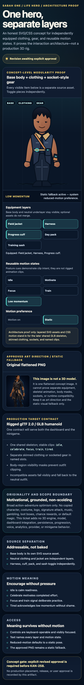

# Life Hero Modular Concept

Status: KAN-257 revision candidate awaiting explicit approval. This is an isolated architecture and interaction proof, not a production avatar, progression system, dashboard feature, or minigame.

## Honest artifact boundary

The deterministic approval surface is `public/concepts/life-hero/index.html`.

`public/concepts/life-hero/life-hero-concept.png` is approved art direction and a static visual fallback only. It is one flattened raster image, not a 3D model. It contains no skeleton, meshes, source layers, equipment slots, animation clips, visibility masks, or runtime compatibility metadata.

The interactive proof uses lightweight layered SVG assets and CSS transforms. It demonstrates that a base body, clothing, and gear can remain separately addressable and that one assembled character can select named motion states. It does not prove production skinning, deformation, clipping, socket alignment, 3D rendering, frame rate, or asset-pipeline compatibility.

## Concept source layers

| Category | Source asset | Proof behavior |
| --- | --- | --- |
| Base body | `layers/body-base.svg` | Always present and independently addressable. |
| Neutral clothing | `layers/clothing-base.svg` | Always present; not baked into the body. |
| Optional clothing | `layers/clothing-jacket.svg` | Field jacket toggles independently. |
| Gear | `layers/gear-harness.svg` | Cross-body harness toggles independently. |
| Gear | `layers/gear-cuff.svg` | Progress cuff toggles independently. |
| Gear | `layers/gear-pack.svg` | Day pack toggles independently. |
| Gear | `layers/gear-training-sash.svg` | Training sash toggles independently. |

The SVG stack is the smallest reversible architecture proof for KAN-257. It is intentionally not the production model or engine selected by KAN-260.

## Motion proof

The visible controls select five concept posture cues:

| Stable production clip name | Concept meaning |
| --- | --- |
| `idle` | Calm readiness. |
| `celebrate` | Motivational acknowledgment of completed effort. |
| `focus` | Quiet concentration. |
| `train` | Deliberate practice. |
| `tired` | Low momentum acknowledged without shame or scolding. |

The page defaults to animated CSS cues when motion is allowed. A visible Static control freezes the selected state. When `prefers-reduced-motion: reduce` is active, the page forces static mode, disables the Motion on control, retains all written meaning, and keeps the flattened PNG available as the static art-direction fallback.

## Production avatar contract

The production target is a rigged glTF 2.0/GLB humanoid consumed through one versioned contract. The dashboard and minigame must reuse this contract rather than defining separate avatar rules.

### Skeleton and animation

- One shared humanoid skeleton identity per contract major version.
- The neutral body and every skinned clothing mesh bind to that skeleton.
- Animation clips use the stable names `idle`, `celebrate`, `focus`, `train`, and `tired`.
- A consumer requests a stable clip name, never an exporter-specific take name or array index.
- A missing optional clip falls back to `idle`; a missing or incompatible skeleton rejects the asset rather than guessing.

### Clothing, gear, and slots

- Body, clothing, and gear remain separately addressable assets.
- Clothing that deforms with the body is skinned to the shared skeleton.
- Rigid gear attaches to named skeleton sockets.
- Named slots are exactly `head`, `torso`, `legs`, `feet`, `back`, `mainHand`, `offHand`, and `accessory` for the first contract version.
- One active asset is allowed per exclusive slot unless a later contract version explicitly declares a composable sub-slot.

### Body-region visibility masks

An outfit can declare regions hidden while it is equipped to prevent body or underlayer clipping. Initial region names are `scalp`, `upperTorso`, `lowerTorso`, `upperArms`, `lowerArms`, `upperLegs`, `lowerLegs`, and `feet`.

Masks affect visibility only. They do not change identity, progression, rewards, data persistence, or gameplay behavior. Unknown region names make the asset incompatible so the consumer does not silently expose clipped geometry.

### Compatibility and fallback rules

Each asset manifest declares:

- contract version;
- required skeleton identity;
- asset kind: body, skinned clothing, or socketed gear;
- occupied named slot;
- optional body-region visibility mask;
- optional compatible body variants;
- required socket name for rigid gear.

Consumers validate the complete loadout before exposure. An incompatible optional asset fails visibly in diagnostics and is omitted. The character falls back to the neutral body and neutral clothing, preserving `idle`. A body or skeleton incompatibility rejects the loadout as a whole. Dashboard and minigame must produce the same compatibility result for the same manifest.

### Contract ownership and revisit trigger

KAN-257 owns this concept contract only. KAN-260 owns production rendering and can refine exporter details without changing the semantic guarantees above. Revisit the contract when a real production model exposes a required skeleton, slot, masking, or clip constraint that this proof cannot represent; do not invent engine behavior in this ticket.

## Originality, motivation, and halal direction

- Original human silhouette, face, palette, and equipment language; no named character, franchise, logo, costume, symbol, pose, or signature attack was copied.
- Calm invitations and concise encouragement; never pressure, shame, or scolding.
- No music requirement or music-themed equipment.
- No gambling, chance reward, loot box, or haram mechanic.
- No weapon, aura, supernatural effect, or default magic.

## Explicit non-goals

KAN-257 adds no production 3D engine or model, dashboard placement, mobile carousel behavior, persistence, progression, rewards, providers, analytics, voice behavior, or minigame behavior. It does not merge, release, deploy, complete Jira, or start KAN-258.

## Rendered evidence

### Desktop — 1440 by 900 viewport

### Mobile — 390 by 844 viewport

### Reduced motion — 390 by 844 viewport

| State | Rendered observation |
| --- | --- |
| Desktop 1440 by 900 | Full-page render is 1440 by 1249 px. The layered hero, equipment controls, motion controls, visibly separate day pack, flattened-PNG warning, and contract boundary render without horizontal overflow. |
| Mobile 390 by 844 | Full-page render is 390 by 3145 px. The layered hero remains ahead of controls in reading order; the alternate loadout visibly adds the day pack and sash while hiding the harness; controls remain reachable and the document scrolls without horizontal overflow. |
| Reduced motion 390 by 844 | Full-page render is 390 by 3145 px. Static mode is selected, Motion on is disabled, Low momentum remains named in text, and the computed avatar animation name is `none`. |

| Evidence file | SHA-256 |
| --- | --- |
| `life-hero-desktop-1440x900.png` | `74ed335a20f8addae46b969b09cd846dae5333d6f6a4f5ab96a2eb6a871c6a07` |
| `life-hero-mobile-390x844.png` | `57c7f3034d0a7824a81425541af6e834ef3d317fa5556a1c670e176aaae6aad0` |
| `life-hero-reduced-motion-390x844.png` | `692bbb1f0c9acd3106ce08301810ec0af3f0f959c5223201b021bb31c8bba3eb` |

## PNG generation record

| Item | Evidence |
| --- | --- |
| Selected flattened asset | `public/concepts/life-hero/life-hero-concept.png` |
| Dimensions | 930 by 1691 PNG |
| SHA-256 | `c14763d2cd25a37eb4d433a26ad9ea25d5aeffeaaacc4fa82368fcce9e690b59` |
| Approved use | Art direction and static fallback only |
