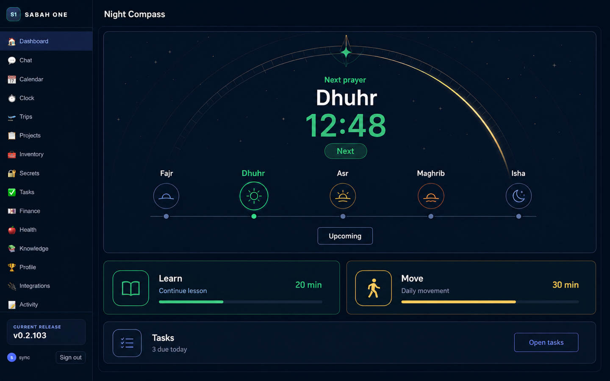

# Night Compass Dashboard Design Contract

Status: selected visual contract for KAN-245. This is design direction, not a production implementation or proof of runtime behavior.

## Authority and boundary

This contract applies to the hosted GitHub Pages dashboard rendered in the browser. It governs presentation only; account data, prayer outcomes, and reminder state still come from the established Supabase and `PrayerProvider` boundaries.

The authority order is:

1. Existing Sabah One domain behavior and canonical prayer records.
2. This deterministic Markdown contract.
3. The selected raster as non-normative art direction.

Generated words, times, counts, icons, progress values, version labels, and control affordances are illustrative. Production work must source real values from existing domain and service boundaries; it must not copy generated values or infer new data shapes from the raster.

KAN-245 changes no React, CSS, runtime API, persistence schema, reminder behavior, or navigation. A later implementation ticket owns those changes.

## Outcome

Replace the dashboard's passive, generic focal area with a practical daily hierarchy:

1. Prayer is the dominant orientation surface.
2. Learn and Move are the next two commitments.
3. Tasks are compact and second-order.

The result should feel calm, nocturnal, precise, and useful. Celestial detail supports orientation without turning the product into ornamental concept art.

## Visual tokens

### Color

| Token | Value | Use |
| --- | --- | --- |
| `--nc-canvas` | `#07111F` | Main canvas and deepest background |
| `--nc-shell` | `#081321` | Navigation shell |
| `--nc-surface` | `#101D31` | Primary card surfaces |
| `--nc-surface-raised` | `#13243D` | Hovered or emphasized surfaces |
| `--nc-border` | `#243650` | Default 1 px borders and separators |
| `--nc-text` | `#F3F0E6` | Primary text |
| `--nc-text-muted` | `#91A0B8` | Supporting labels and metadata |
| `--nc-emerald` | `#2FCB8F` | Next-prayer emphasis and Learn accent |
| `--nc-emerald-strong` | `#20AE78` | Active controls and high-contrast emerald text |
| `--nc-moon-gold` | `#E6C66A` | Celestial arc and Move accent |
| `--nc-moon-gold-strong` | `#C9A84F` | Gold control borders and emphasis |
| `--nc-late` | `#D79A46` | Canonical late outcome only |
| `--nc-missed` | `#E87373` | Canonical missed outcome only |
| `--nc-focus` | `#8FE7C4` | Keyboard focus ring |

Purple, violet, magenta, and multicolour AI gradients are not part of this surface. Colour must never be the only carrier of state.

### Typography

Use the existing product font stack. Prefer a humanist system sans-serif; do not introduce a display-font dependency.

| Role | Desktop | Mobile | Weight | Line height |
| --- | ---: | ---: | ---: | ---: |
| Surface title | 24 px | 20 px | 700 | 1.2 |
| Next prayer name | 44 px | 32 px | 700 | 1.05 |
| Next prayer time | 64 px | 48 px | 700 | 1.0 |
| Section title | 20 px | 18 px | 650 | 1.25 |
| Card title | 17 px | 16 px | 650 | 1.3 |
| Body | 14 px | 14 px | 400 | 1.5 |
| Metadata | 12 px | 12 px | 500 | 1.4 |
| Eyebrow/status | 11 px | 11 px | 700 | 1.3 |

Use tabular numerals for prayer times and counts. Truncate only user-authored task or learning titles, never prayer names or state labels.

### Spacing and shape

Use a 4 px base unit. Allowed spacing steps are `4`, `8`, `12`, `16`, `24`, `32`, and `48` px.

- Main content gutters: 28 px at 1440, 20 px at 1024, 16 px at 390.
- Card internal padding: 24 px for Prayer, 20 px for Learn/Move, 16 px for Tasks.
- Card gap: 16 px desktop, 12 px mobile.
- Card radius: 16 px for Prayer and 14 px for supporting cards.
- Pill radius: 999 px.
- Borders: 1 px; use a 2 px focus ring with a 2 px offset.
- Shadows: black at no more than 24% opacity and 24 px blur. Do not use glass blur.

## Celestial geometry

The compass is a quiet structural layer inside the Prayer card.

- Draw one elliptical arc spanning approximately 72% of the card width and 42% of its height.
- Use a 1 px moon-gold stroke at 60% opacity with a short brighter segment pointing toward the next prayer.
- Add evenly spaced 1 px compass ticks. The ticks do not encode time or progress.
- Use one emerald orientation marker centred over the next-prayer axis.
- Limit decorative star points to 12 at desktop and 5 at mobile; keep them below 35% opacity.
- Decorative geometry is `aria-hidden`, non-interactive, and removed under forced-colours mode.
- No generated ornament may be interpreted as religious content, a timetable calculation, or functional evidence.

## Content hierarchy

### Prayer — tier one

Prayer occupies at least 55% of the initial dashboard content area at 1440 and remains the first content block at every width.

Required anatomy:

1. `Next prayer` eyebrow.
2. Next prayer name and authoritative local time.
3. A temporal `Next` badge.
4. A fixed-order five-prayer sequence: Fajr, Dhuhr, Asr, Maghrib, Isha.
5. A text label for each temporal or outcome state; colour and icon are supplemental.

The five prayer names are always represented when prayer tracking is enabled. Sunnah events and sunrise may appear only in a subordinate disclosure; they never displace the five required prayers.

### Learn and Move — tier two

Learn and Move receive equal visual weight. Each card contains:

- one title;
- one grounded next action or truthful empty state;
- optional duration only when sourced from real data;
- one restrained progress indicator only when a real denominator exists;
- one action target covering the whole card or one explicit button, not both.

Emerald is Learn's accent. Moon-gold is Move's accent. Neither card may exceed Prayer's title, time, area, or contrast.

### Tasks — tier three

Tasks is a single compact row or card after Learn and Move. It may show one grounded count and one route to the Tasks surface. It must not repeat `Up Next`, reproduce a task queue, or compete with Prayer.

## Prayer state contract

Temporal position and recorded outcome are separate axes.

| Axis | Value | Presentation |
| --- | --- | --- |
| Temporal | `next` | Emerald ring or marker plus the text `Next`; strongest prayer in the sequence |
| Temporal | `upcoming` | Neutral border and the text `Upcoming` where needed |
| Temporal | `past` | Reduced emphasis; show an outcome only when one is recorded |
| Outcome | `unclassified` | Neutral outline and text; never imply completion |
| Outcome | `on_time` | Emerald outcome token plus `On time` |
| Outcome | `late` | Amber outcome token plus `Late` |
| Outcome | `missed` | Red outcome token plus `Missed` |

Rules:

- `Next` is never stored or presented as a prayer outcome.
- `On time`, `Late`, and `Missed` are shown only from canonical prayer records.
- Do not infer an outcome from the current time, a task completion flag, colour, or generated mockup text.
- A next prayer must not simultaneously show a completed outcome badge for the same pending occurrence.
- When timetable data is loading, keep the five names visible and use stable skeletons for times.
- When timetable data is unavailable, use em dashes for times and one actionable error message. Never fabricate a fallback time.
- When prayer tracking is disabled, replace the compass body with a calm enablement explanation; do not show simulated statuses.

## Supporting states

| Component | Empty | Active | Complete/unavailable |
| --- | --- | --- | --- |
| Learn | `Choose what to learn next` with one route | Grounded title and optional real duration/progress | Completed state remains low emphasis; unavailable data shows one retry or route |
| Move | `Plan today's movement` with one route | Grounded activity and optional real duration/progress | Completed state remains low emphasis; unavailable data shows one retry or route |
| Tasks | `No tasks due today` | Grounded due/overdue count and `Open tasks` | Loading uses one compact skeleton; errors do not replace Prayer |

Loading must not shift the overall card geometry. Errors remain local to the component that failed.

## Responsive adaptation

| Width | Shell | Prayer | Learn / Move | Tasks |
| --- | --- | --- | --- | --- |
| 1440 | Preserve the 220 px desktop navigation rail and full header | Large radial card; next prayer centred; five prayers on one line | Two equal columns | One compact full-width strip |
| 1024 | Preserve the desktop shell; reduce main gutters to 20 px | Compress outer celestial rings and typography; keep all five prayers on one line | Two columns while each remains at least 280 px; otherwise stack Learn then Move | Full-width strip below tier two |
| 390 | Use the existing mobile shell/navigation; no persistent desktop rail | First card in document order; simplify to one arc and five equal columns; 48 px focal time; no horizontal page overflow | Stack Learn then Move as full-width cards | Final compact card, minimum 44 px action target |

Additional responsive rules:

- The semantic order is Prayer, Learn, Move, Tasks in both DOM and reading order.
- The five-prayer band must fit without horizontal page scrolling at 390 px. Prayer labels may use 11 px metadata type but may not abbreviate names.
- Hide decorative stars and non-semantic ticks before hiding any prayer label or state.
- Content may scroll vertically. Fixed-height clipping is prohibited.
- At 200% text zoom, actions and prayer names remain reachable and no state label overlaps another.

## Interaction and accessibility

- Minimum pointer target: 44 by 44 px.
- Keyboard focus: 2 px `--nc-focus` ring with 2 px offset.
- Text contrast target: 4.5:1 for body and metadata, 3:1 for large text and non-text controls.
- Pair every status colour with visible text and, where useful, an icon.
- Respect `prefers-reduced-motion`; disable arc sweeps, pulsing stars, and progress animation.
- Do not announce decorative celestial geometry.
- Preserve existing route names and navigation behavior.
- Do not add a second mutation path; dashboard actions must reuse the established task, prayer, chat, and voice boundaries.

## Acceptance checks for implementation

A later production implementation is visually conformant only when:

- Prayer is the first and largest dashboard region at 1440, 1024, and 390.
- Fajr, Dhuhr, Asr, Maghrib, and Isha are all visible in the required order.
- Temporal and outcome states follow the independent state axes above.
- Learn and Move form tier two; Tasks remains compact tier three.
- The palette uses midnight navy, emerald, and moon-gold without generic purple AI treatment.
- There is no horizontal page overflow at 390 px and no clipped content at 200% text zoom.
- Rendered evidence is inspected at each required width.
- Runtime behavior is supported by focused tests and live/rendered evidence; this raster alone is never cited as proof.

## Artifact record

| Item | Evidence |
| --- | --- |
| Baseline screenshot | `test-results/mobile-ui/0.2.103/1787877841273-63432/1440x900/dashboard.png` (ignored acceptance artifact), SHA-256 `7878c326e66c611a500886cac01b25928762ca9830a8777b4ac856d3a5337029` |
| Generation mode | Built-in image generation, `ui-mockup`, baseline used as shell/layout reference |
| Generative iterations | One initial generation and one targeted correction |
| Selected project raster | `docs/design/night-compass-dashboard-1440x900.png`, 1440 by 900 PNG, SHA-256 `9f9efa9f43f6399d5842669b9a40036587c836f2bb57a7472e17fa3f4158d3d9` |
| Authoritative contract | `docs/design/night-compass-contract.md` |

The selected raster was dimension-normalized from the corrected built-in output to the required 1440 by 900 project artifact. No additional generative correction was performed.
